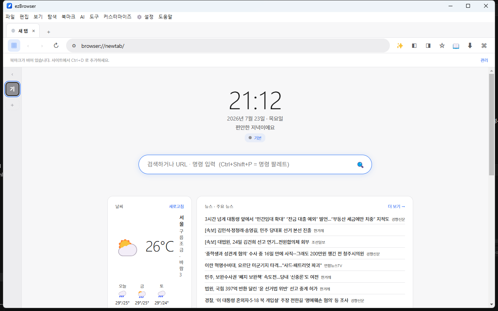
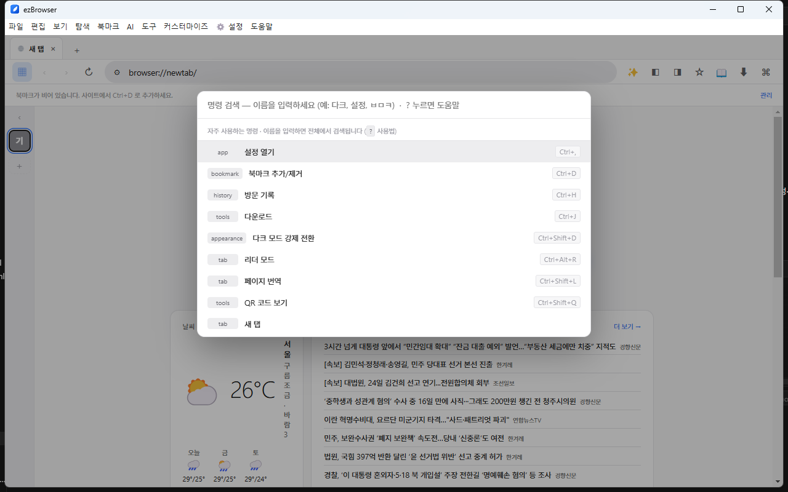
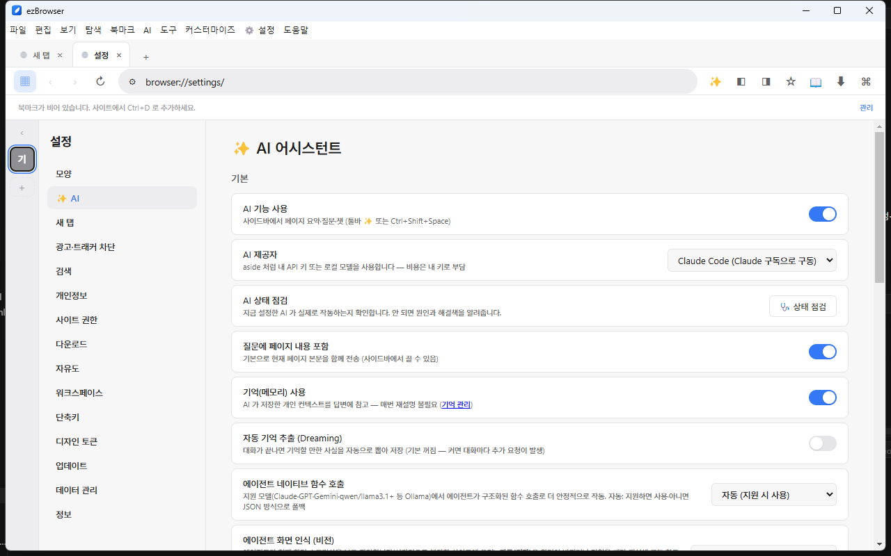
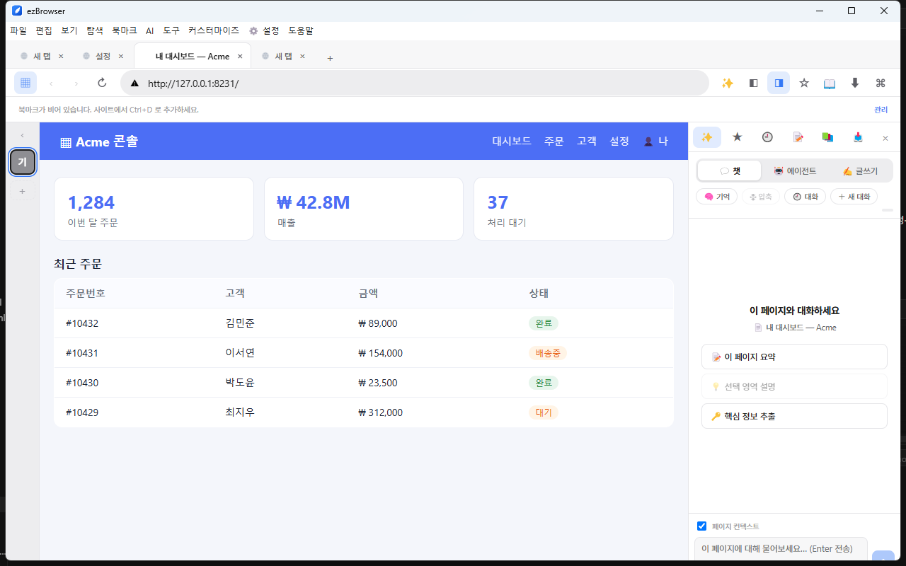
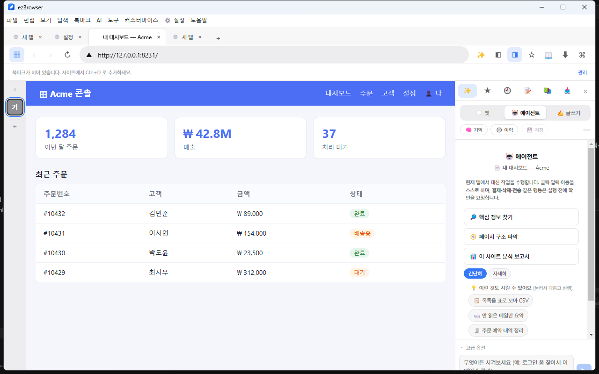
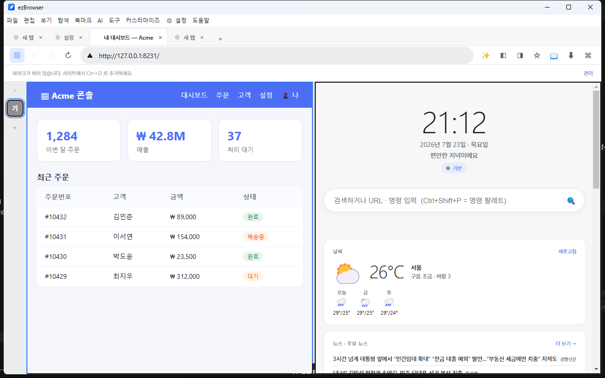

# ezBrowser 사용 설명서

가볍고, 크롬 확장이 그대로 붙고, 광고차단·번역·다운로드가 기본 내장되고, **AI 에이전트가 로그인된 사이트에서 대신 일해주는** 데스크톱 브라우저입니다.

이 문서는 **어떻게 쓰는지**를 설명합니다.

---

## 1. 설치

1. [최신 릴리즈](https://github.com/baboplater-blip/ezBrowser/releases/latest)에서 `ezBrowser-x.y.z-win-x64.exe`를 내려받습니다.
2. 더블클릭하면 **설치 위치를 묻지 않고 바로 설치**되고 자동 실행됩니다. (Chrome·Edge와 같은 방식)
3. 미서명 빌드라 처음 실행 시 Windows SmartScreen 경고가 나올 수 있습니다 → **추가 정보 → 실행**을 누르면 됩니다.

> 설치 위치: `%LOCALAPPDATA%\Programs\browser-build\ezBrowser.exe`
> 내 데이터(북마크·설정·비밀번호 등): `%APPDATA%\browser-build`

**업데이트**는 자동입니다. 새 버전이 올라오면 앱이 알아서 감지해 배너로 알려주고, **받기 → 재시작**만 누르면 됩니다. (부팅 1분 뒤 + 6시간마다 확인)

---

## 2. 기본 사용법

### 탭 · 주소창
- **새 탭** `Ctrl+T` · **탭 닫기** `Ctrl+W` · **닫은 탭 복원** `Ctrl+Shift+T`
- **주소창 포커스** `Ctrl+L` — URL을 입력하거나 그냥 검색어를 쳐도 됩니다.
- 주소창에서 `!yt 고양이` 처럼 **bang**을 쓰면 유튜브에서 바로 검색됩니다 (`!g` 구글, `!n` 네이버 등).
- **다음/이전 탭** `Ctrl+Tab` / `Ctrl+Shift+Tab` · **뒤로/앞으로** `Alt+←` / `Alt+→`
- 탭을 드래그해 순서를 바꾸거나, 우클릭으로 **고정·그룹·음소거·복제**할 수 있습니다.

### 무엇이든 텍스트로 — 명령 팔레트 `Ctrl+Shift+P`
모든 기능·설정·매크로를 이름으로 찾아 실행합니다. 단축키가 기억나지 않을 때 여기서 검색하세요. (한글 초성 검색도 됩니다.)

### 검색하고 찾기
- **탭 검색** `Ctrl+Shift+A` — 열린 탭이 많을 때 이름으로 빠르게 이동.
- 페이지에서 **텍스트를 드래그**하면 작은 검색 버튼이 떠올라 바로 검색할 수 있습니다.

### 북마크 · 기록 · 다운로드
- **북마크 추가/제거** `Ctrl+D` (주소창 옆 ★) · **북마크 바 토글** `Ctrl+Shift+B`
- **방문 기록** `Ctrl+H` · **기록 삭제** `Ctrl+Shift+Delete` (기간 선택)
- **다운로드 패널** `Ctrl+J`

---

## 3. 기본 내장 기능 (별도 확장 없이 바로 됨)

| 하고 싶은 것 | 방법 |
|---|---|
| **광고·트래커 차단** | 기본 ON. 주소창 왼쪽 자물쇠 → 사이트별로 끄고 켤 수 있습니다. (강도 3단계: 설정) |
| **동영상 다운로드** | 영상이 있는 페이지에서 툴바의 ▶ 아이콘이 켜집니다. 눌러 화질을 고르면 저장. (YouTube·HLS·DASH·MP4) |
| **토렌트 받기** | `magnet:` 링크나 `.torrent` 파일을 열면 내장 다운로더가 바로 처리합니다. |
| **페이지 번역** | `Ctrl+Shift+L` — 페이지 전체를 한국어로. |
| **스크린샷** | 명령 팔레트에서 "스크린샷" → 영역/전체 캡처 → 클립보드 + PNG 저장. |
| **다크 모드(강제)** | `Ctrl+Shift+D` — 어떤 사이트든 어둡게. |
| **리더 모드** | `Ctrl+Alt+R` — 본문만 깔끔하게. |
| **QR 코드** | `Ctrl+Shift+Q` — 현재 페이지 주소를 QR로. |
| **비밀번호 저장·자동입력** | 로그인하면 저장 여부를 물어봅니다. OS 보안 저장소로 암호화. 관리: `Ctrl+Shift+;` |
| **마우스 제스처** | 우클릭 드래그: ← 뒤로 · → 앞으로 · ↑ 새로고침 · ↓ 새 탭 |
| **새 탭 위젯** | 새 탭에 자주 가는 사이트·**날씨·뉴스**·메모·할 일·환율·바로가기 (위 첫 화면 참고). 설정에서 켜고 끔. |
| **사이드 패널** | `Ctrl+B`(왼쪽) / `Ctrl+Alt+B`(오른쪽) — 북마크·이력·메모·AI. |

---

## 4. AI 어시스턴트 · 에이전트 ⭐

브라우저 오른쪽 `✨` 버튼 또는 `Ctrl+Shift+Space`로 **AI 사이드바**를 엽니다. 챗 / 에이전트 / 글쓰기 세 가지 모드가 있습니다.

### 준비 (한 번만) — 내 계정/키 연결 (BYOK)
AI는 **내 계정이나 키를 직접** 씁니다. 설정 → **✨ AI**에서 하나 고릅니다:
- **Claude 구독** → `Claude Code` (Claude Code CLI 설치 시, 별도 요금 없음)
- **Google Gemini** → 무료 키 발급 ([aistudio.google.com](https://aistudio.google.com), 신용카드 불필요)
- **OpenAI(ChatGPT) / 로컬 Ollama** 도 선택 가능

잘 안 되면 같은 화면의 **🩺 상태 점검**이 원인과 해결책을 알려줍니다.

### 💬 챗 모드 — 지금 보는 페이지에 대해 대화
"이 페이지 요약해줘", "이 표에서 핵심만 뽑아줘" 처럼 물어보면 **현재 페이지 내용을 알고** 답합니다. 대화는 저장되어 재시작해도 이어지고, 폴더·태그로 정리할 수 있습니다.

### 🤖 에이전트 모드 — 대신 일하기
로그인된 사이트에서 **AI가 직접 클릭하고 입력하며** 작업합니다. 무엇을 시킬지 막막하면 **예시 작업 버튼**을 눌러 시작하세요 — 목록을 CSV로 뽑기 · 안 읽은 메일 요약 · 주문/예약 내역 정리 · 답글 초안 쓰기 · 폼 자동 작성 · 원하는 정보 찾기.

작동 방식:
- AI가 **한 단계씩 화면을 보고 판단**해 진행하고, 그 과정을 사이드바에 실시간으로 보여줍니다.
- **결제·삭제·전송·게시** 같은 민감한 동작 직전에는 **반드시 사용자에게 확인**을 받습니다.
- 자주 쓰는 작업은 **매크로로 저장**해 어느 페이지에서든 한 번에 재실행할 수 있고, 실행 이력도 남습니다.

### 📊 사이트 분석 보고서
로그인된 사이트를 **읽기 전용으로 여러 페이지 훑어보고** 마크다운 보고서를 만들어 사이드바에 보여주고 `.md` 파일로 저장합니다. (간단히/자세히 선택) → **✍️ 편집**으로 글쓰기 스튜디오에서 다듬기.

### 🧠 기억(Memory)
자주 쓰는 정보(이름·선호 등)를 AI가 기억해 매번 다시 설명할 필요가 없습니다. `browser://ai-memory`에서 직접 편집할 수 있습니다.

> **안전:** API 키는 OS 암호화 저장소에만 보관되고 AI에게 노출되지 않습니다. 비밀번호·자동입력 값도 AI에게 전달되지 않습니다.

---

## 5. 크롬 확장 붙이기

- 크롬 웹스토어에서 받은 **`.crx` 파일을 창에 드래그**하면 설치됩니다.
- `browser://extensions`에서 켜고 끄거나 삭제합니다.
- uBlock Origin Lite · Dark Reader · Bitwarden · Vimium · Tampermonkey 등 상위 확장 대부분이 그대로 동작합니다. (MV2/MV3)

---

## 6. 내 마음대로 (자유도)

- **레이아웃** — 탭바를 위·왼쪽·오른쪽으로(`Ctrl+Alt+T`), 화면을 좌우/상하 **분할**(`Ctrl+Alt+\` / `Ctrl+Alt+-`). 두 페이지를 나란히 보며 작업하세요.

- **워크스페이스** — 색·세션·시작페이지가 분리된 여러 공간. `Ctrl+Alt+←/→`로 전환, 왼쪽 색 막대에서 관리. (예: 일 / 개인 분리)
- **단축키 재바인딩** — 설정 → 단축키에서 **모든 키를 바꿀 수 있습니다** (충돌 자동 검출).
- **userChrome.css / userScript** — 브라우저 UI 자체나 웹페이지에 내 CSS·JS를 주입 (Tampermonkey 호환).
- **사이트별 정책** — `browser://policies`에서 사이트마다 User-Agent·쿠키·권한·헤더를 규칙으로 지정.
- **데이터 백업** — 설정 → 데이터 관리에서 북마크·설정·비밀번호·AI 대화까지 한 파일로 내보내기/가져오기.

전체 설정: 주소창에 `browser://settings` · 설정 열기 단축키: `Ctrl+,`

---

## 7. 자주 쓰는 단축키 요약

| 키 | 동작 | 키 | 동작 |
|---|---|---|---|
| `Ctrl+T` | 새 탭 | `Ctrl+L` | 주소창 |
| `Ctrl+W` | 탭 닫기 | `Ctrl+H` | 방문 기록 |
| `Ctrl+Shift+T` | 닫은 탭 복원 | `Ctrl+J` | 다운로드 |
| `Ctrl+Shift+A` | 탭 검색 | `Ctrl+D` | 북마크 |
| `Ctrl+Shift+P` | 명령 팔레트 | `Ctrl+Shift+Space` | AI 사이드바 |
| `Ctrl+Shift+L` | 페이지 번역 | `Ctrl+Shift+D` | 다크 모드 |
| `Ctrl+Alt+R` | 리더 모드 | `Ctrl+Shift+N` | 시크릿 창 |
| `Ctrl+B` | 왼쪽 패널 | `Ctrl+,` | 설정 |

> 모든 단축키는 설정에서 바꿀 수 있습니다.

---

## 문제가 있을 때

- **AI가 응답 안 함** → 설정 → ✨ AI → **🩺 상태 점검**으로 원인·해결책 확인 (키 미설정, Ollama 모델 미설치 등).
- **광고가 보임** → 자물쇠 메뉴에서 해당 사이트 차단이 꺼져있는지 확인.
- **업데이트가 안 옴** → 설정 → 업데이트 → "지금 업데이트 확인".

즐겁게 쓰세요. 🚀
